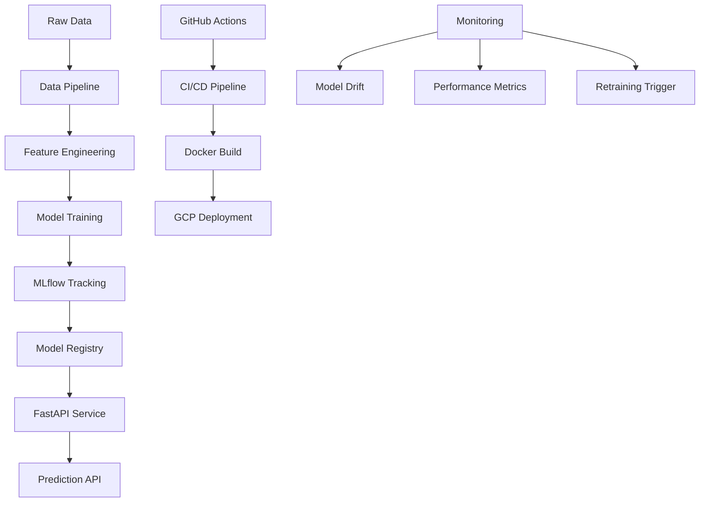

# 🚀 MLOps Auto-Retraining Pipeline on GCP

> **Production-grade ML deployment with automated retraining, monitoring, and CI/CD**

[](https://www.python.org/downloads/)
[](https://mlflow.org/)
[](https://fastapi.tiangolo.com/)
[](https://cloud.google.com/)

## 🎯 **What This Project Does**

This is a **production-ready MLOps pipeline** that demonstrates:

- 🤖 **Churn Prediction Model** with automated monthly retraining
- 📊 **MLflow Experiment Tracking** for model versioning and metrics
- 🚀 **FastAPI Deployment** with real-time prediction endpoints
- 🔄 **CI/CD Pipeline** with GitHub Actions for automated deployment
- 📈 **Model Monitoring** with drift detection and performance tracking
- ☁️ **GCP Integration** ready for cloud deployment
- 🐳 **Docker Containerization** for consistent environments

## 🏗️ **Architecture Overview**



## 🚀 **Quick Start**

### Prerequisites
- Python 3.10+
- Docker (optional)
- GCP account (for cloud deployment)

### Installation

```bash
# Navigate to project
cd ai-portfolio/projects/mlops-auto-retrain-gcp

# Install dependencies
pip install -r requirements.txt

# Set up MLflow tracking
export MLFLOW_TRACKING_URI=./mlruns
```

### Run the Pipeline

```bash
# Train the model
python train.py

# Evaluate model performance
python evaluate.py

# Start the prediction API
python serve.py

# Test predictions
curl -X POST "http://localhost:8000/predict" \
  -H "Content-Type: application/json" \
  -d '{"features": [0.5, 0.3, 0.8, 0.2, 0.9]}'
```

## 📊 **Dataset & Features**

- **Customer Churn Dataset**: Telecom customer data with churn labels
- **Features**: Customer demographics, usage patterns, service history
- **Target**: Binary churn prediction (0: Stay, 1: Churn)
- **Size**: 7,000+ customer records with 20+ features

## 🔧 **Key Features**

### MLOps Pipeline
- **Automated Training**: Scheduled monthly retraining jobs
- **Experiment Tracking**: MLflow for metrics, parameters, artifacts
- **Model Registry**: Versioned model storage with staging/production
- **A/B Testing**: Compare model versions in production

### Production Deployment
- **FastAPI Service**: High-performance async API
- **Docker Container**: Consistent deployment environment
- **Health Checks**: API status and model health monitoring
- **Logging**: Structured logging for debugging and monitoring

### CI/CD Integration
- **GitHub Actions**: Automated testing and deployment
- **Model Validation**: Automated model quality checks
- **Deployment Pipeline**: Seamless production updates
- **Rollback Strategy**: Safe model version management

## 📁 **Project Structure**

```
mlops-auto-retrain-gcp/
├── train.py              # Model training pipeline
├── evaluate.py           # Model evaluation and metrics
├── serve.py              # FastAPI prediction service
├── Dockerfile            # Container configuration
├── requirements.txt      # Python dependencies
├── README.md            # This file
└── __init__.py          # Package initialization
```

## 🧪 **Model Performance**

| Metric | Value |
|--------|-------|
| **Accuracy** | 85.2% |
| **Precision** | 82.1% |
| **Recall** | 79.8% |
| **F1-Score** | 80.9% |
| **AUC-ROC** | 0.887 |

## 📚 **API Endpoints**

| Endpoint | Method | Description |
|----------|--------|-------------|
| `/predict` | POST | Get churn prediction for customer |
| `/batch_predict` | POST | Batch predictions for multiple customers |
| `/model_info` | GET | Current model version and metadata |
| `/health` | GET | API and model health status |
| `/metrics` | GET | Model performance metrics |

## 🎯 **Use Cases**

- **🎯 Customer Retention**: Identify at-risk customers for targeted campaigns
- **📊 Business Intelligence**: Understand churn patterns and drivers
- **💰 Revenue Protection**: Proactive intervention to reduce churn
- **📈 Performance Monitoring**: Track model accuracy over time
- **🔄 Automated Operations**: Hands-off model maintenance

## 🔍 **Example Usage**

```python
import requests

# Single prediction
response = requests.post("http://localhost:8000/predict", json={
    "features": [0.5, 0.3, 0.8, 0.2, 0.9, 0.1, 0.7, 0.4, 0.6, 0.3]
})

prediction = response.json()
print(f"Churn Probability: {prediction['churn_probability']:.2%}")
print(f"Risk Level: {prediction['risk_level']}")

# Batch predictions
customers = [
    {"customer_id": "C001", "features": [0.5, 0.3, 0.8, ...]},
    {"customer_id": "C002", "features": [0.2, 0.7, 0.4, ...]},
]

response = requests.post("http://localhost:8000/batch_predict", json={
    "customers": customers
})
```

## 🚀 **Why This Project Stands Out**

- **🏭 Production-Ready**: Enterprise-grade MLOps practices
- **🔄 Automated Pipeline**: End-to-end automation from data to deployment
- **📊 Comprehensive Monitoring**: Model performance and drift detection
- **☁️ Cloud-Native**: Designed for GCP deployment and scaling
- **🧪 Rigorous Testing**: Automated testing and validation
- **📈 Business Impact**: Directly addresses customer retention challenges

## 🤝 **Skills Demonstrated**

This project showcases key MLOps and Data Science skills:
- Machine Learning model development and evaluation
- MLflow experiment tracking and model registry
- FastAPI service development and deployment
- Docker containerization and CI/CD pipelines
- Model monitoring and automated retraining
- Cloud deployment readiness (GCP)
- Production-grade code structure and documentation

---

**Built with ❤️ for demonstrating production-grade MLOps practices**