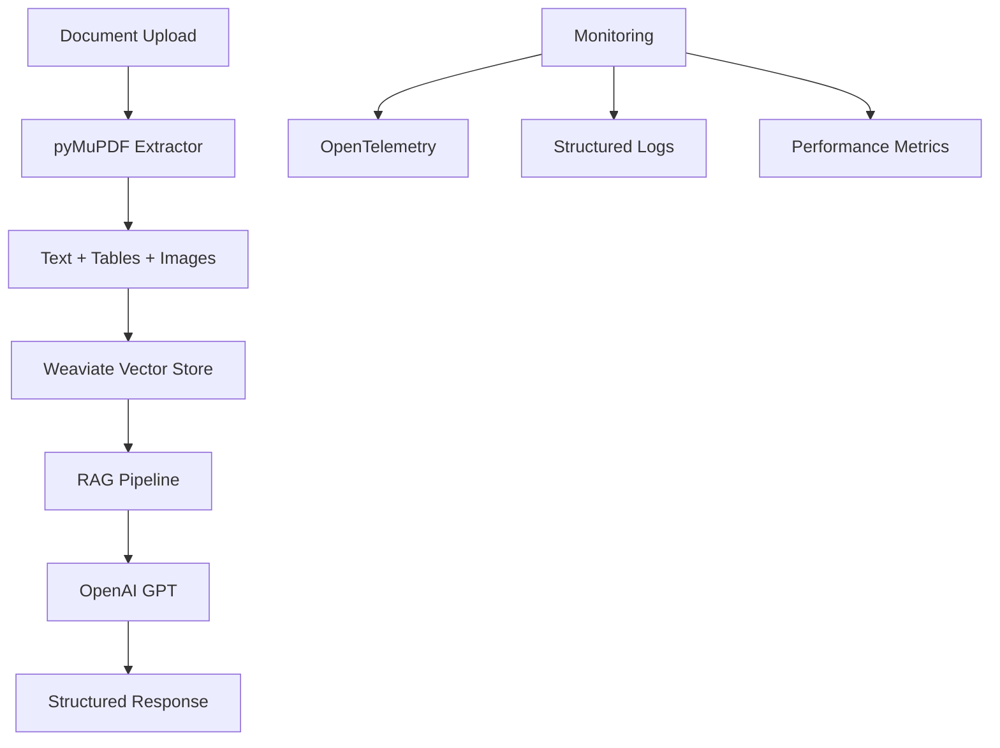

# 🤖 Multi-Modal RAG Chatbot with pyMuPDF

> **Production-grade Retrieval-Augmented Generation system for processing invoices, contracts, and multi-modal documents**

[](https://www.python.org/downloads/)
[](https://fastapi.tiangolo.com/)
[](https://weaviate.io/)
[](https://pymupdf.readthedocs.io/)

## 🎯 **What This Project Does**

This is a **production-ready RAG (Retrieval-Augmented Generation) chatbot** that can:

- 📄 **Process complex PDFs** (invoices, contracts, legal documents) using pyMuPDF
- 🖼️ **Extract text from images** with advanced OCR capabilities  
- 📊 **Parse tables and structured data** from documents
- 🔍 **Perform semantic search** using Weaviate vector database
- 💬 **Answer questions** about your documents using OpenAI GPT models
- 📈 **Monitor performance** with OpenTelemetry and structured logging
- 🚀 **Scale in production** with FastAPI and async processing

## 🏗️ **Architecture Overview**



## 🚀 **Quick Start**

### Prerequisites
- Python 3.10+
- OpenAI API key
- Weaviate instance (local or cloud)

### Installation

```bash
# Clone and navigate to project
cd ai-portfolio/projects/rag-chatbot-multimodal

# Install dependencies using uv
uv sync

# Set up environment
cp env.template .env
# Edit .env with your API keys
```

### Run the System

```bash
# Start the API server
uv run uvicorn src.rag_chatbot.api.app:app --reload

# Test the pipeline
uv run python test_pipeline.py

# Access the API
open http://localhost:8000/docs
```

## 📊 **Datasets Included**

- **📋 IOB Invoice Dataset**: Multi-layout invoices with OCR ground truth
- **📜 CUAD Contract Dataset**: 500+ legal contracts for Q&A testing

## 🔧 **Key Features**

### Document Processing
- **pyMuPDF Integration**: Superior PDF parsing with table detection
- **Multi-modal Support**: PDFs, images (PNG, JPG, TIFF, BMP)
- **OCR with Confidence**: Pytesseract with quality scoring
- **Structured Extraction**: Text blocks, tables, images with metadata

### RAG Pipeline
- **Weaviate Vector Store**: Hybrid semantic + keyword search
- **LangChain Integration**: Modular RAG components
- **Chunking Strategy**: Intelligent text segmentation
- **Context Retrieval**: Relevant document sections for answers

### Production Features
- **FastAPI Backend**: Async API with automatic docs
- **OpenTelemetry**: Distributed tracing and metrics
- **Structured Logging**: JSON logs with correlation IDs
- **Error Handling**: Graceful failures with detailed errors
- **Health Checks**: System status monitoring

## 📁 **Project Structure**

```
rag-chatbot-multimodal/
├── src/rag_chatbot/
│   ├── api/                    # FastAPI application
│   │   ├── app.py             # Main API server
│   │   └── models.py          # Pydantic models
│   ├── core/                   # Configuration & logging
│   │   ├── config.py          # Settings management
│   │   └── logger.py          # Structured logging
│   ├── data/                   # Dataset management
│   │   └── dataset_manager.py # Data loading & preparation
│   ├── document_processing/    # Multi-modal extraction
│   │   └── extractor.py       # pyMuPDF-based processor
│   └── rag/                    # RAG pipeline
│       ├── pipeline.py        # Main RAG logic
│       └── vector_store.py    # Weaviate integration
├── data/                       # Data storage
│   ├── raw/                   # Original datasets
│   ├── processed/             # Processed documents
│   └── samples/               # Test samples
├── test_pipeline.py           # End-to-end testing
└── pyproject.toml            # Dependencies & config
```

## 🧪 **Testing**

```bash
# Run comprehensive pipeline test
uv run python test_pipeline.py

# Test specific components
uv run python -m pytest tests/ -v

# Test API endpoints
curl -X POST "http://localhost:8000/chat" \
  -H "Content-Type: application/json" \
  -d '{"message": "What are the payment terms?", "conversation_id": "test"}'
```

## 📚 **API Endpoints**

| Endpoint | Method | Description |
|----------|--------|-------------|
| `/chat` | POST | Submit queries to RAG system |
| `/upload` | POST | Upload documents for processing |
| `/documents` | GET | List processed documents |
| `/health` | GET | System health check |
| `/docs` | GET | Interactive API documentation |

## 🎯 **Use Cases**

- **📋 Invoice Processing**: Extract line items, totals, vendor info
- **📜 Contract Analysis**: Find clauses, terms, obligations
- **🏢 Legal Document Q&A**: Answer questions about legal texts
- **📊 Financial Report Analysis**: Parse tables and financial data
- **🔍 Document Search**: Semantic search across document collections

## 🔍 **Example Usage**

```python
import requests

# Upload a document
files = {"file": open("invoice.pdf", "rb")}
response = requests.post("http://localhost:8000/upload", files=files)

# Ask questions about it
response = requests.post("http://localhost:8000/chat", json={
    "message": "What is the total amount on this invoice?",
    "conversation_id": "invoice-analysis"
})

print(response.json()["response"])
```

## 🚀 **Why This Project Stands Out**

- **🏭 Production-Ready**: Built with enterprise patterns and monitoring
- **🔧 Modern Stack**: Latest versions of FastAPI, LangChain, Weaviate
- **📊 Performance Focused**: Async processing, efficient vector search
- **🛡️ Robust Error Handling**: Graceful failures and detailed logging
- **📈 Scalable Architecture**: Designed for cloud deployment
- **🧪 Thoroughly Tested**: Comprehensive test suite and examples

## 🤝 **Contributing**

This project showcases production-grade AI/ML engineering skills including:
- Multi-modal document processing
- Vector database integration
- RAG pipeline architecture
- API design and monitoring
- Modern Python development practices

---

**Built with ❤️ for demonstrating production-grade RAG systems**
