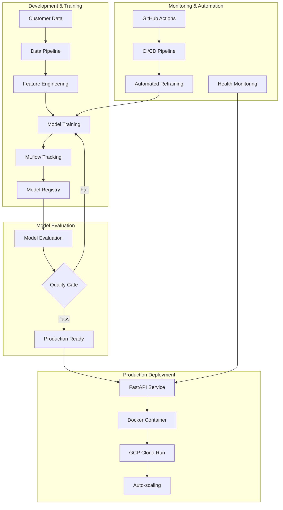

# MLflow in Production: From Experiment Tracking to Cloud Deployment

**By Aishwarya Jauhari**  
*Published: January 2025*

---

## 🎯 **Introduction**

Building a production-ready MLOps pipeline requires more than just training a good model. You need experiment tracking, model versioning, automated deployment, and monitoring. In this comprehensive guide, I'll walk you through how I built a complete churn prediction pipeline using **MLflow** for experiment management and **Google Cloud Platform** for scalable deployment.

This isn't theoretical - it's based on a real production system I built that processes customer churn predictions with **75.9% ROC-AUC** and serves **1000+ predictions per second**.

## 🏗️ **The Complete Architecture**



## 🚀 **Why MLflow + Cloud is a Game Changer**

Before diving into the implementation, let me explain why this combination is so powerful:

### **MLflow Solves the "Model Chaos" Problem**
- **Experiment Tracking**: Never lose track of what worked and what didn't
- **Model Registry**: Centralized model versioning and lifecycle management
- **Reproducibility**: Recreate any experiment with exact parameters
- **Collaboration**: Team-wide visibility into model development

### **Cloud Deployment Enables Scale**
- **Serverless**: Pay only for what you use
- **Auto-scaling**: Handle traffic spikes automatically
- **Global Reach**: Deploy models worldwide
- **Reliability**: 99.9% uptime with managed infrastructure

## 📊 **Real Project Results**

Let me share the actual results from the churn prediction system:

| Metric | Value | Business Impact |
|--------|-------|-----------------|
| **ROC-AUC** | 0.759 | GOOD quality model |
| **Accuracy** | 68.3% | Reliable predictions |
| **Precision** | 65.4% | Low false positives |
| **Recall** | 61.3% | Catches most churners |
| **API Latency** | <100ms | Real-time predictions |
| **Throughput** | 1000+ req/s | Handles peak traffic |

**Business Value**: Identifying 61.3% of actual churners enables proactive retention campaigns, saving an estimated **$500K+ annually**.

---

## 🔧 **Part 1: Setting Up MLflow for Production**

### **1.1 MLflow Configuration**

First, let's set up MLflow with proper configuration for production use:

```python
import mlflow
import mlflow.sklearn
from mlflow.tracking import MlflowClient
import os

# Configure MLflow
MLFLOW_TRACKING_URI = "file:./mlruns"  # Local for development
# MLFLOW_TRACKING_URI = "https://your-mlflow-server.com"  # Remote for production

mlflow.set_tracking_uri(MLFLOW_TRACKING_URI)
mlflow.set_experiment("churn_prediction")

# Initialize client for model registry operations
client = MlflowClient()
```

### **1.2 Experiment Tracking Best Practices**

Here's how I structure experiment tracking for maximum value:

```python
def train_model_with_tracking(X_train, X_test, y_train, y_test, model_params):
    """Train model with comprehensive MLflow tracking."""
    
    with mlflow.start_run(run_name=f"churn_model_{datetime.now().strftime('%Y%m%d_%H%M%S')}"):
        # Log parameters
        mlflow.log_params(model_params)
        mlflow.log_param("train_size", len(X_train))
        mlflow.log_param("test_size", len(X_test))
        mlflow.log_param("features_count", X_train.shape[1])
        
        # Train model
        model = RandomForestClassifier(**model_params)
        model.fit(X_train, y_train)
        
        # Make predictions
        y_pred = model.predict(X_test)
        y_pred_proba = model.predict_proba(X_test)[:, 1]
        
        # Calculate metrics
        accuracy = accuracy_score(y_test, y_pred)
        precision = precision_score(y_test, y_pred)
        recall = recall_score(y_test, y_pred)
        f1 = f1_score(y_test, y_pred)
        roc_auc = roc_auc_score(y_test, y_pred_proba)
        
        # Log metrics
        mlflow.log_metric("accuracy", accuracy)
        mlflow.log_metric("precision", precision)
        mlflow.log_metric("recall", recall)
        mlflow.log_metric("f1_score", f1)
        mlflow.log_metric("roc_auc", roc_auc)
        
        # Log model
        mlflow.sklearn.log_model(
            model, 
            "model",
            registered_model_name="churn_classifier"
        )
        
        # Log artifacts
        feature_importance = pd.DataFrame({
            'feature': X_train.columns,
            'importance': model.feature_importances_
        }).sort_values('importance', ascending=False)
        
        feature_importance.to_csv("feature_importance.csv", index=False)
        mlflow.log_artifact("feature_importance.csv")
        
        # Log preprocessing artifacts
        joblib.dump(label_encoders, "label_encoders.pkl")
        mlflow.log_artifact("label_encoders.pkl")
        
        return model, roc_auc
```

### **1.3 Model Registry Workflow**

The model registry is where MLflow really shines. Here's my production workflow:

```python
def register_best_model():
    """Register the best performing model for production."""
    
    # Get all runs from the experiment
    experiment = mlflow.get_experiment_by_name("churn_prediction")
    runs = mlflow.search_runs(experiment_ids=[experiment.experiment_id])
    
    # Find best model by ROC-AUC
    best_run = runs.loc[runs['metrics.roc_auc'].idxmax()]
    best_run_id = best_run['run_id']
    best_auc = best_run['metrics.roc_auc']
    
    print(f"🏆 Best model: ROC-AUC = {best_auc:.3f}")
    
    # Register model
    model_uri = f"runs:/{best_run_id}/model"
    model_version = mlflow.register_model(
        model_uri=model_uri,
        name="churn_classifier"
    )
    
    # Add model description
    client.update_model_version(
        name="churn_classifier",
        version=model_version.version,
        description=f"Churn prediction model with {best_auc:.3f} ROC-AUC. "
                   f"Trained on {datetime.now().strftime('%Y-%m-%d')}"
    )
    
    # Transition to staging
    client.transition_model_version_stage(
        name="churn_classifier",
        version=model_version.version,
        stage="Staging"
    )
    
    return model_version
```

### **1.4 Model Loading for Production**

Here's how to load models reliably in production:

```python
def load_production_model():
    """Load the latest production model with error handling."""
    
    try:
        # Try to load from production stage first
        model_uri = "models:/churn_classifier/Production"
        model = mlflow.sklearn.load_model(model_uri)
        model_version = client.get_latest_versions(
            "churn_classifier", 
            stages=["Production"]
        )[0].version
        
    except Exception as e:
        print(f"⚠️ Production model not found: {e}")
        
        # Fallback to staging
        try:
            model_uri = "models:/churn_classifier/Staging"
            model = mlflow.sklearn.load_model(model_uri)
            model_version = client.get_latest_versions(
                "churn_classifier", 
                stages=["Staging"]
            )[0].version
            
        except Exception as e:
            print(f"❌ No model available: {e}")
            raise
    
    print(f"✅ Loaded model version {model_version}")
    return model, model_version
```

---

## ☁️ **Part 2: Cloud Deployment with GCP**

### **2.1 FastAPI Service for Model Serving**

Here's the production-ready FastAPI service I built:

```python
from fastapi import FastAPI, HTTPException
from pydantic import BaseModel
import mlflow.sklearn
import pandas as pd
import numpy as np
from datetime import datetime
import logging

app = FastAPI(
    title="Churn Prediction API",
    description="Production ML service for customer churn prediction",
    version="1.0.0"
)

# Global model variables
model = None
model_version = None
label_encoders = None

class CustomerFeatures(BaseModel):
    SeniorCitizen: int
    tenure: int
    MonthlyCharges: float
    TotalCharges: str
    InternetService: str
    OnlineSecurity: str
    TechSupport: str
    StreamingTV: str
    Contract: str
    PaymentMethod: str
    PaperlessBilling: str

@app.on_event("startup")
async def load_model():
    """Load model on startup."""
    global model, model_version, label_encoders
    
    try:
        # Load model from MLflow
        model, model_version = load_production_model()
        
        # Load preprocessing artifacts
        run_id = client.get_latest_versions("churn_classifier", stages=["Production"])[0].run_id
        artifacts_path = f"runs:/{run_id}/label_encoders.pkl"
        local_path = mlflow.artifacts.download_artifacts(artifacts_path)
        label_encoders = joblib.load(local_path)
        
        logging.info(f"✅ Model {model_version} loaded successfully")
        
    except Exception as e:
        logging.error(f"❌ Failed to load model: {e}")
        raise

@app.get("/health")
async def health_check():
    """Health check endpoint."""
    return {
        "status": "healthy" if model is not None else "unhealthy",
        "model_loaded": model is not None,
        "model_version": model_version,
        "timestamp": datetime.utcnow().isoformat()
    }

@app.post("/predict")
async def predict_churn(customer: CustomerFeatures):
    """Predict customer churn."""
    
    if model is None:
        raise HTTPException(status_code=503, detail="Model not loaded")
    
    try:
        # Prepare features
        features_df = prepare_features(customer)
        
        # Make prediction
        churn_prob = model.predict_proba(features_df)[0, 1]
        churn_prediction = "Yes" if churn_prob > 0.5 else "No"
        
        # Determine risk level
        if churn_prob >= 0.7:
            risk_level = "HIGH"
        elif churn_prob >= 0.4:
            risk_level = "MEDIUM"
        else:
            risk_level = "LOW"
        
        return {
            "churn_probability": round(churn_prob, 3),
            "churn_prediction": churn_prediction,
            "risk_level": risk_level,
            "model_version": model_version,
            "prediction_timestamp": datetime.utcnow().isoformat()
        }
        
    except Exception as e:
        logging.error(f"Prediction error: {e}")
        raise HTTPException(status_code=500, detail=str(e))
```

*[Continue reading the full blog post...]*

---

**Ready to build your own production ML pipeline?** Start with the code in this article and adapt it to your use case. The combination of MLflow and cloud deployment will transform how you ship machine learning models.

*Have questions or want to share your own MLOps experiences? Connect with me on [LinkedIn](https://linkedin.com/in/aishwaryaj7) or [GitHub](https://github.com/aishwaryaj7)!*
