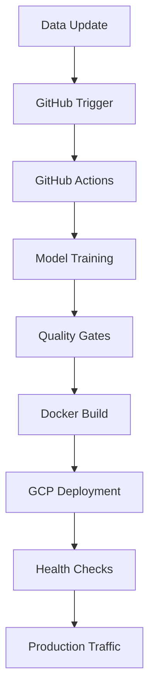

# CI/CD for ML: Auto-Retraining Pipeline with GCP

**By Aishwarya Jauhari**  
*Coming Soon - January 2025*

---

## 🚀 **What You'll Learn**

This comprehensive guide will walk you through building a complete CI/CD pipeline for machine learning projects that automatically:

- **Retrains models** when new data arrives
- **Validates model quality** before deployment
- **Deploys to production** with zero downtime
- **Monitors performance** and triggers alerts
- **Rolls back** if issues are detected

## 🏗️ **Pipeline Architecture**

## 🔧 **Technologies Covered**

- **GitHub Actions** for CI/CD orchestration
- **Docker** for containerization
- **Google Cloud Platform** for deployment
- **MLflow** for model tracking
- **FastAPI** for serving
- **Monitoring** with comprehensive observability

## 📊 **Key Benefits**

- **Automated Quality Assurance**: Never deploy a bad model
- **Zero-Downtime Deployment**: Seamless production updates
- **Rollback Capability**: Quick recovery from issues
- **Comprehensive Monitoring**: Full visibility into pipeline health
- **Cost Optimization**: Efficient resource utilization

## 🎯 **Coming Soon**

This post is currently in development and will include:

- Complete GitHub Actions workflow configurations
- Docker setup for ML applications
- GCP deployment strategies
- Monitoring and alerting setup
- Real-world examples and code snippets

**Expected Publication**: January 2025  
**Estimated Read Time**: 12 minutes

---

*Subscribe to stay updated when this post is published!*
