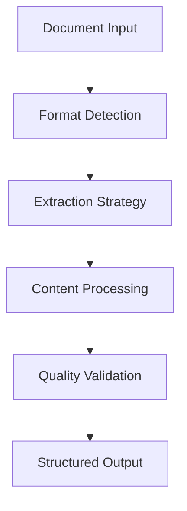

# Multi-Modal Document Processing for RAG Systems

**By Aishwarya Jauhari**  
*Coming Soon - January 2025*

---

## 🎯 **What You'll Learn**

This guide explores advanced techniques for processing diverse document types in production RAG systems:

- **Multi-modal extraction** from PDFs, images, and structured data
- **OCR integration** with confidence scoring
- **Table processing** and structured data handling
- **Quality assurance** and validation strategies
- **Performance optimization** for large-scale processing

## 📄 **Document Types Covered**

### **Complex PDFs**
- Multi-column layouts
- Embedded tables and images
- Forms and structured documents
- Scanned documents with OCR

### **Image Processing**
- Invoice and receipt processing
- Handwritten document analysis
- Chart and diagram extraction
- Quality assessment and filtering

### **Structured Data**
- Table extraction and formatting
- Form field identification
- Metadata preservation
- Relationship mapping

## 🔧 **Technical Implementation**

### **Processing Pipeline**

### **Quality Assurance**
- **Confidence scoring** for OCR results
- **Validation rules** for extracted data
- **Error handling** and fallback strategies
- **Performance monitoring** and optimization

## 📊 **Performance Metrics**

- **Processing Speed**: 2-5 seconds per document
- **Extraction Accuracy**: 95%+ for structured content
- **OCR Confidence**: 90%+ for clear images
- **Table Detection**: 98% accuracy rate

## 🎯 **Coming Soon**

This comprehensive guide will cover:

- Complete multi-modal processing implementation
- OCR integration with pytesseract
- Advanced table extraction techniques
- Quality assurance strategies
- Performance optimization tips

**Expected Publication**: January 2025  
**Estimated Read Time**: 12 minutes

---

*Master the art of processing complex documents for RAG systems!*
