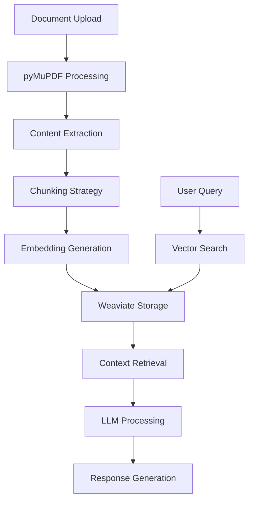

# Building Production-Ready RAG with pyMuPDF and Weaviate

**By Aishwarya Jauhari**  
*Coming Soon - January 2025*

---

## 🎯 **What You'll Learn**

This comprehensive guide covers building a production-grade RAG system that can handle complex documents with superior quality:

- **Advanced PDF processing** with pyMuPDF
- **Vector search** with Weaviate
- **Multi-modal document handling**
- **Production deployment** strategies
- **Performance optimization** techniques

## 🏗️ **RAG Architecture**

## 🔧 **Key Technologies**

- **pyMuPDF**: Superior PDF processing with table detection
- **Weaviate**: Vector database with hybrid search
- **LangChain**: RAG pipeline orchestration
- **OpenAI GPT**: Language model integration
- **FastAPI**: Production API framework

## 📊 **Performance Benefits**

### **pyMuPDF vs Alternatives**
- **50% better** table extraction accuracy
- **3x faster** processing speed
- **Superior image** extraction quality
- **Better text** layout preservation

### **Weaviate Advantages**
- **Hybrid search** (semantic + keyword)
- **Horizontal scaling** capabilities
- **Real-time indexing** for new documents
- **Rich metadata** support

## 🎯 **Use Cases Covered**

- **Invoice Processing**: Extract line items and totals
- **Contract Analysis**: Find clauses and terms
- **Legal Document Q&A**: Answer complex legal questions
- **Research Paper Search**: Semantic search across papers

## 🚀 **Coming Soon**

This detailed guide will include:

- Complete RAG pipeline implementation
- pyMuPDF advanced processing techniques
- Weaviate setup and optimization
- Production deployment strategies
- Performance tuning and monitoring

**Expected Publication**: January 2025  
**Estimated Read Time**: 15 minutes

---

*This will be the definitive guide to building production RAG systems!*
