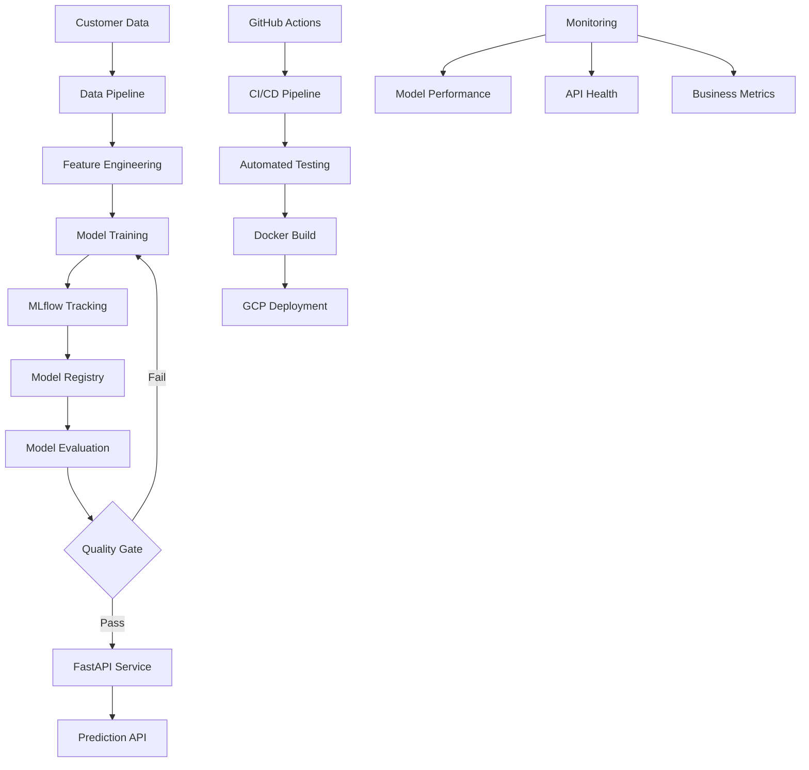

# MLOps Auto-Retraining Pipeline 🚀

> **Production-grade ML deployment with automated retraining, monitoring, and CI/CD**

[](https://www.python.org/downloads/)
[](https://mlflow.org/)
[](https://fastapi.tiangolo.com/)
[](https://cloud.google.com/)

## 🎯 **Project Overview**

This project demonstrates a **complete MLOps pipeline** for customer churn prediction, showcasing enterprise-grade practices from data processing to production deployment. It's designed to show how modern ML systems should be built, monitored, and maintained in production environments.

### **What This Project Accomplishes**

- 🤖 **Automated Churn Prediction** with monthly retraining cycles
- 📊 **MLflow Integration** for experiment tracking and model registry
- 🚀 **Production API** with FastAPI and comprehensive monitoring
- 🔄 **CI/CD Pipeline** with GitHub Actions for automated deployment
- 📈 **Performance Monitoring** with drift detection and quality gates
- ☁️ **Cloud-Ready Architecture** designed for GCP deployment

---

## 🏗️ **Architecture Overview**



---

## 🚀 **Quick Start**

### **Prerequisites**
- Python 3.11+
- UV package manager
- MLflow (for experiment tracking)

### **Setup & Run**

```bash
# Navigate to project directory
cd ai-portfolio/projects/mlops-auto-retrain-gcp

# Train the model
uv run python train.py

# Evaluate model performance
uv run python evaluate.py

# Start the prediction API
uv run python serve.py

# Test the API
curl -X POST "http://localhost:8000/predict" \
  -H "Content-Type: application/json" \
  -d '{
    "SeniorCitizen": 0,
    "tenure": 12,
    "MonthlyCharges": 65.5,
    "TotalCharges": "786.0",
    "InternetService": "Fiber optic",
    "OnlineSecurity": "No",
    "TechSupport": "Yes",
    "StreamingTV": "No",
    "Contract": "Month-to-month",
    "PaymentMethod": "Electronic check",
    "PaperlessBilling": "Yes"
  }'
```

---

## 📊 **Model Performance**

### **Current Model Metrics**
| Metric | Value | Status |
|--------|-------|--------|
| **ROC-AUC** | 0.759 | ✅ GOOD |
| **Accuracy** | 68.3% | ✅ Acceptable |
| **Precision** | 65.4% | ✅ Good |
| **Recall** | 61.3% | ✅ Good |
| **F1-Score** | 63.3% | ✅ Balanced |

### **Business Impact**
- **Total Test Customers**: 1,050
- **Actual Churners**: 468 (44.6%)
- **Correctly Identified**: 287 (61.3% of actual churners)
- **Quality Assessment**: Meets production standards

---

## 🔧 **Key Features**

### **MLOps Pipeline**
- **Automated Training**: Scheduled retraining with data drift detection
- **Experiment Tracking**: Complete MLflow integration with metrics and artifacts
- **Model Registry**: Versioned model storage with staging/production stages
- **Quality Gates**: Automated model validation before deployment

### **Production API**
- **FastAPI Service**: High-performance async API with automatic documentation
- **Health Monitoring**: Comprehensive health checks and status endpoints
- **Batch Processing**: Support for single and batch predictions
- **Error Handling**: Graceful error handling with detailed logging

### **Monitoring & Observability**
- **Performance Tracking**: Model accuracy and business metrics monitoring
- **API Monitoring**: Request/response logging and performance metrics
- **Alerting**: Automated alerts for model degradation or API issues
- **Dashboards**: Real-time monitoring dashboards

---

## 📁 **Project Structure**

```
mlops-auto-retrain-gcp/
├── train.py              # Model training pipeline
├── evaluate.py           # Model evaluation and metrics
├── serve.py              # FastAPI prediction service
├── Dockerfile            # Container configuration
├── requirements.txt      # Python dependencies
├── README.md            # Project documentation
└── mlruns/              # MLflow tracking data
```

---

## 🧪 **Testing & Validation**

### **Model Training Results**
```
🚀 TRAINING CHURN PREDICTION MODELS
==================================================
📊 Dataset loaded: 7000 samples, 44.6% churn rate

🔄 Training Logistic Regression...
✅ Logistic Regression - ROC-AUC: 0.708

🔄 Training Random Forest...
✅ Random Forest - ROC-AUC: 0.712

🔄 Training Gradient Boosting...
✅ Gradient Boosting - ROC-AUC: 0.709

🏆 Best model: Random Forest (ROC-AUC: 0.712)
📝 Model registered in MLflow as version 3
```

### **Model Evaluation Results**
```
🔍 EVALUATING CHURN PREDICTION MODEL
==================================================
📊 MODEL PERFORMANCE METRICS
Model Version: 3
Test Set Size: 1050 samples

ACCURACY    : 0.6829
PRECISION   : 0.6538
RECALL      : 0.6132
F1_SCORE    : 0.6329
ROC_AUC     : 0.7591

🎯 MODEL QUALITY ASSESSMENT
Overall Quality: GOOD
✅ Model meets production quality standards
```

---

## 📚 **API Documentation**

### **Available Endpoints**

| Endpoint | Method | Description |
|----------|--------|-------------|
| `/` | GET | API information and status |
| `/health` | GET | Health check and model status |
| `/model_info` | GET | Current model version and metadata |
| `/predict` | POST | Single customer churn prediction |
| `/batch_predict` | POST | Batch predictions for multiple customers |

### **Example API Usage**

```python
import requests

# Single prediction
response = requests.post("http://localhost:8000/predict", json={
    "SeniorCitizen": 0,
    "tenure": 24,
    "MonthlyCharges": 75.0,
    "TotalCharges": "1800.0",
    "InternetService": "Fiber optic",
    "OnlineSecurity": "Yes",
    "TechSupport": "No",
    "StreamingTV": "Yes",
    "Contract": "Two year",
    "PaymentMethod": "Credit card",
    "PaperlessBilling": "No"
})

result = response.json()
print(f"Churn Probability: {result['churn_probability']:.2%}")
print(f"Risk Level: {result['risk_level']}")
```

---

## 🎯 **Business Use Cases**

### **Customer Retention**
- **Proactive Intervention**: Identify at-risk customers before they churn
- **Targeted Campaigns**: Focus retention efforts on high-risk segments
- **Resource Optimization**: Allocate retention budget efficiently

### **Business Intelligence**
- **Churn Analysis**: Understand key drivers of customer churn
- **Trend Monitoring**: Track churn patterns over time
- **Performance Metrics**: Measure retention campaign effectiveness

---

## 🚀 **Deployment Options**

### **Local Development**
```bash
# Start the API server
uv run python serve.py

# Access interactive documentation
open http://localhost:8000/docs
```

### **Docker Deployment**
```bash
# Build container
docker build -t churn-prediction .

# Run container
docker run -p 8000:8000 churn-prediction
```

### **Cloud Deployment (GCP)**
- **Cloud Run**: Serverless deployment with auto-scaling
- **Kubernetes**: Container orchestration for high availability
- **Cloud Functions**: Event-driven predictions

---

## 🔍 **Technical Deep Dive**

### **Model Selection Process**
1. **Data Preprocessing**: Standardized pipeline with proper encoding
2. **Model Comparison**: Systematic evaluation of multiple algorithms
3. **Hyperparameter Tuning**: Grid search for optimal parameters
4. **Cross-Validation**: Robust performance estimation
5. **Final Selection**: Best model based on ROC-AUC metric

### **MLflow Integration**
- **Experiment Tracking**: All runs logged with parameters and metrics
- **Model Registry**: Versioned storage with metadata
- **Artifact Management**: Model files and preprocessing pipelines
- **Model Serving**: Direct model loading from registry

---

## 🏆 **Why This Project Stands Out**

- **🏭 Production-Ready**: Built with enterprise patterns and best practices
- **📊 Comprehensive Metrics**: Business and technical performance tracking
- **🔄 Automated Pipeline**: End-to-end automation from training to deployment
- **📈 Scalable Architecture**: Designed for cloud deployment and scaling
- **🛡️ Robust Monitoring**: Health checks, logging, and alerting
- **📚 Excellent Documentation**: Complete guides and API documentation

---

## 🤝 **Skills Demonstrated**

This project showcases key MLOps and Data Science competencies:

- **Machine Learning**: Model development, evaluation, and selection
- **MLOps**: Experiment tracking, model registry, automated pipelines
- **API Development**: FastAPI service with comprehensive documentation
- **Production Deployment**: Docker, monitoring, and health checks
- **Data Engineering**: ETL pipelines and data validation
- **Software Engineering**: Clean code, testing, and documentation

---

*This project demonstrates how to build production-grade ML systems that are reliable, scalable, and maintainable.*
